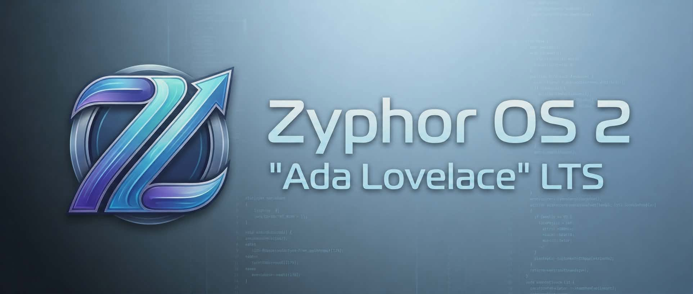
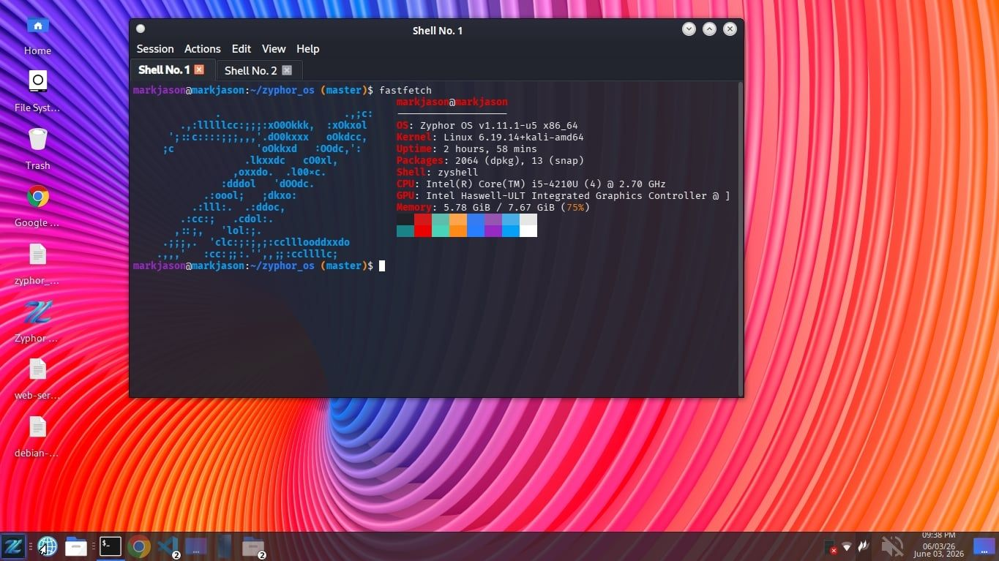
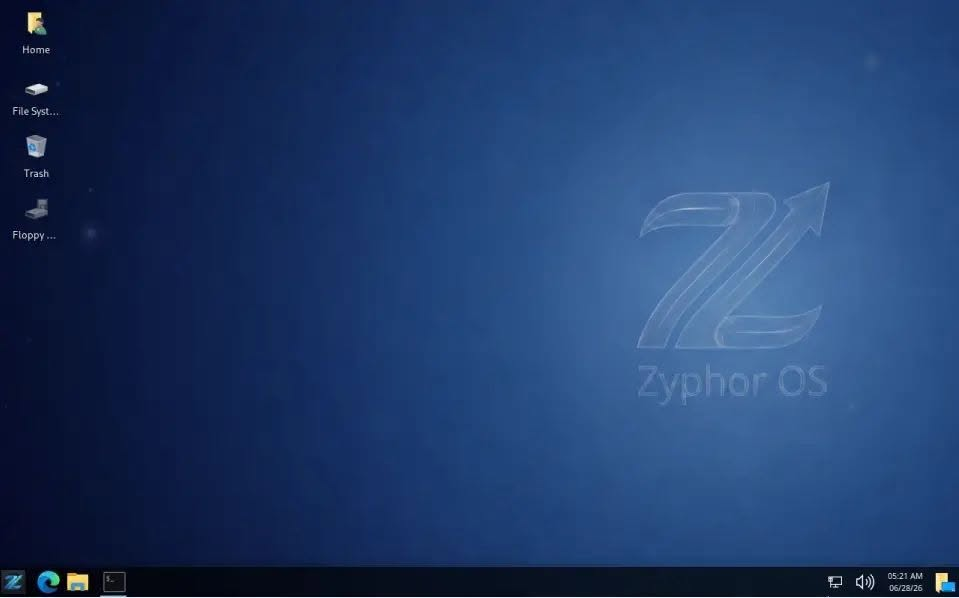
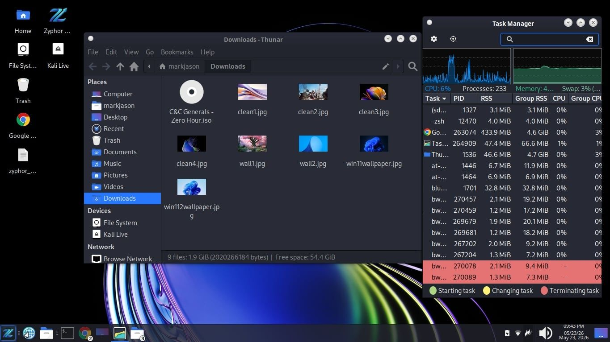
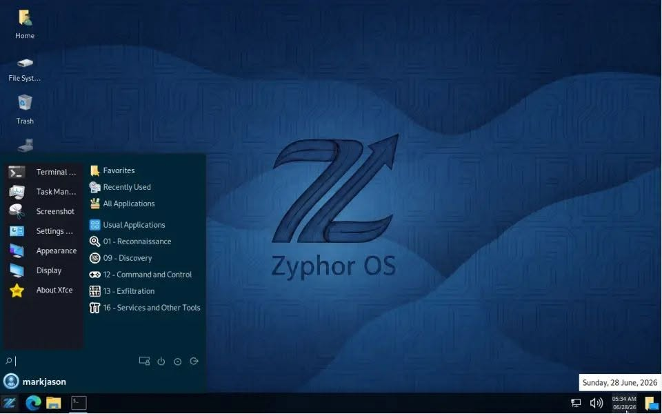
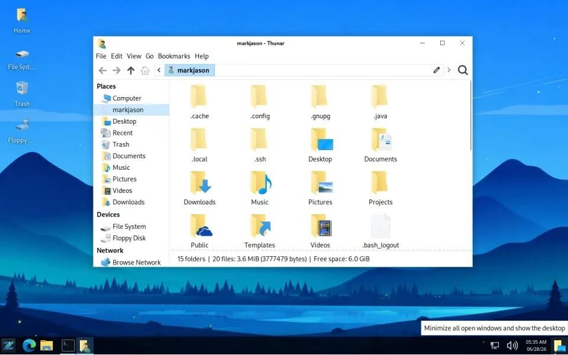
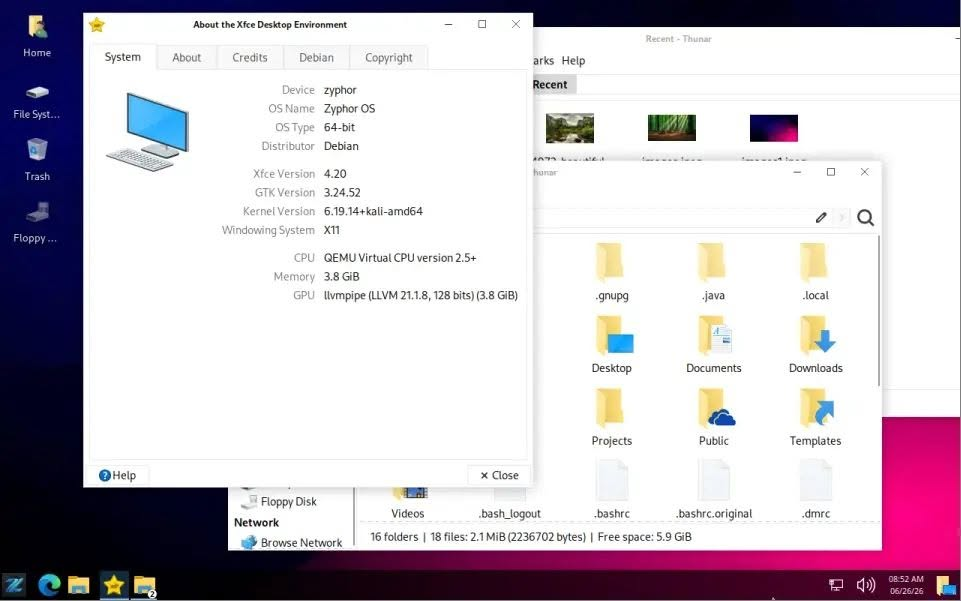
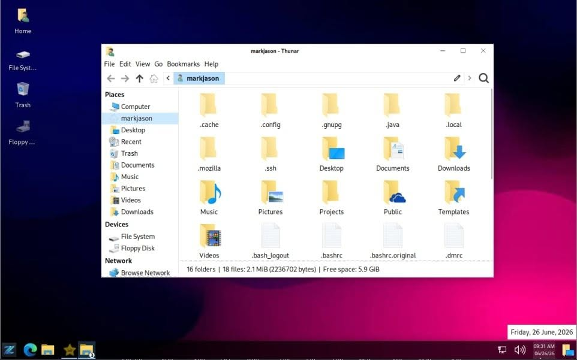
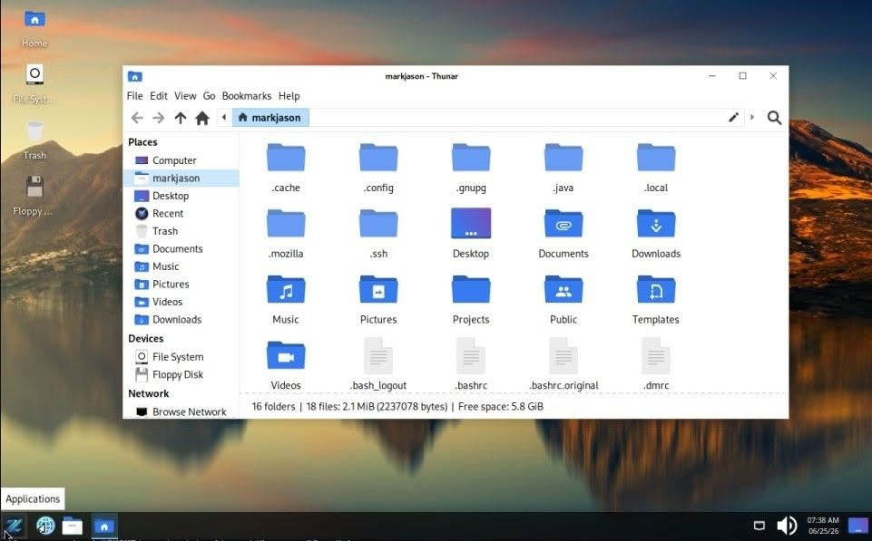
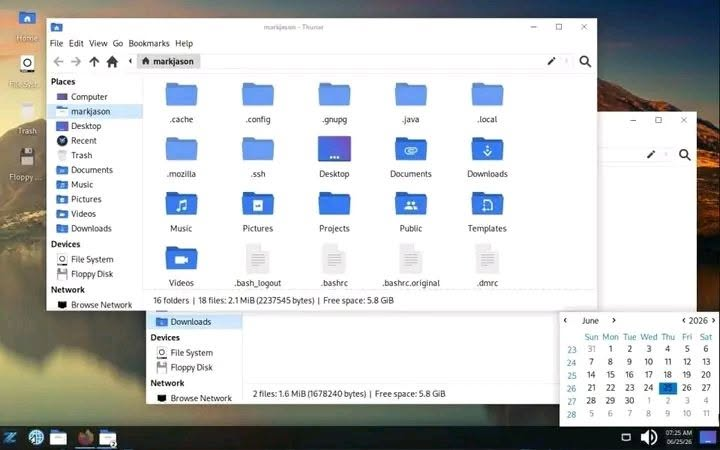

## 📚 Installer

Download the latest **Zyphor OS ISO** and get started in minutes.

👉 **[Click Here To Download Zyphor Operating System ISO (v2.2.1-2026.07.21-r17)](https://drive.google.com/uc?export=download&id=1wymp5-YilWQwkFtyw3XB-3bEuXVbbaJe)** - Main lightweight desktop release  

👉 **[Click Here To Download Zyphor Horizon ISO (v1.0.0-beta-2026.06.14-r1)](https://drive.google.com/uc?export=download&id=1eRYZQN7W-4aB1hp6SXclQwdO8Qzh31Ko)** - Experimental / futuristic preview release  

> 📦 Hosted on Google Drive  
> 💿 File Type: ISO Image  

After installing, open the terminal and run this command:
```bash
zyphor help
```

Old Versions  

[v1.13.0-r5 - Stable Version (From March - July 2026)](https://drive.google.com/uc?export=download&id=1CAUJLU0N_lXVSSejHHethg9BlYOVDi5r)   

---

**Creator:** Mark Jason Penote Espelita, the Zyphor OS Community, and Contributors  
**Facebook Account:** https://www.facebook.com/mark.jason.penote.espelita  
**Facebook Page:** https://www.facebook.com/profile.php?id=61573426796629  
**Website:** https://zyphor-os.github.io  
**Email:** markjasonespelita02@gmail.com  
**Contact:** 09978972884 | 09203454006  
**Our Philosophy:** [ZyphorOSPhilosophy.docx](https://github.com/markjasonespelita/zyphor_os/blob/master/DOCUMENTATION/ZyphorOSPhilosophy.docx)  
**Date Created:** March 30, 2026

---
**Other projects under Zyphor OS**

Zyphor OS Server - https://github.com/zyphor-os/zyphor-os-server

Zyphor OS Minimal - https://github.com/zyphor-os/zyphor-os-minimal

Zyphor OS Documentation - https://github.com/zyphor-os/zyphor-os.github.io

Website - https://zyphor-os.github.io

---

## Contributors

Contributors are not limited to software developers. Some collaborators contributed through ideas, testing, security assessments, bug reporting, graphic design, documentation, feedback, and community support. Their efforts have helped shape and improve Zyphor OS, and their contributions are sincerely appreciated.

---

| Avatar | Name | Role |
|:---:|:---|:---|
|  | [Mark Jason Espelita](https://github.com/markjasonespelita) | Zyphor OS Creator and Lead Maintainer (Host) |
|  | [Mark Jason Espelita](https://github.com/mjespelita) | Maintainer's 2nd Account |
|  | [Mark Jason Espelita](https://github.com/mjfrontendservices) | Maintainer's 3rd Account |
|  | [Semantic Release Bot](https://github.com/semantic-release-bot) | CI/CD Automated Bot |
|  | [Dan Stephen Blanco](https://github.com/fen-lowcode) | Security Tester |
|  | [Nicole Honrado Ervas](https://github.com/NicoleHonradoErvas) | Graphic Artist |
|  | [Jenalyn Iso](https://github.com/isojenalyn14) | Graphic Artist |
|  | [John Rey A. Castillo](https://github.com/JanRey36) | Full Stack Web Developer |

---

# Introduction

**Zyphor OS** is a custom Linux distribution built on top of the powerful foundations of **Kali Linux** and **Debian**.

Designed with simplicity, performance, and control in mind, **Zyphor OS** aims to deliver a streamlined operating system experience without unnecessary bloat.

One of **Zyphor OS**’s core goals is to provide a Windows-like user experience — making it easy for users transitioning from Windows to feel right at home. From layout and navigation to workflow and usability, **Zyphor OS** minimizes the learning curve while still offering the full power of Linux underneath.

## 📸 Screenshots

<p align="center">
  
  
</p>

<p align="center">
  
  
</p>

<p align="center">
  
  
</p>

<p align="center">
  
  
</p>

<p align="center">
  
  
</p>

<p align="center">
  
</p>

---

## 📚 References

- 🌐 [Debian Official Website](https://www.debian.org)
- 🐉 [Kali Linux Official Website](https://www.kali.org)
- 🧠 [The Linux Kernel (GitHub)](https://github.com/torvalds/linux)

---

## 📄 Attribution & Licensing

**Zyphor OS** is a custom Linux distribution built on top of  
**Debian** and **Kali Linux**.

We gratefully acknowledge the work of the developers and communities behind these projects.

- **Debian** provides the core system and package ecosystem.  
- **Kali Linux**, developed by **Offensive Security**, provides security tools and system enhancements.

---

## 📜 License

**Zyphor OS**-specific configurations, scripts, and customizations are licensed under the GNU General Public License (GPL).

You are free to use, modify, and distribute these components under the terms of the GPL, provided that any distributed modified versions are also released under the same license.

This ensures that improvements to Zyphor OS remain open source and benefit the community.

---

## ⚖️ Third-Party Software

**Zyphor OS** includes software packages distributed under various open-source licenses, including but not limited to:

- **GNU General Public License (GPL)** 
- **MIT License**
- **Apache License**

All original licenses remain in effect and are fully respected.

License details for individual packages can be found in:

```bash
/usr/share/doc/*/copyright
```
---

## ⚠️ Disclaimer

**Zyphor OS** is an independent project and is not affiliated with, endorsed by, or sponsored by:

**Debian** 
**Kali Linux** 
**Offensive Security** 

All trademarks and registered trademarks are the property of their respective owners.

---

## 🛡️ Branding

The name **"Zyphor OS"** and its logo are the property of the creator.

Redistribution of modified versions using the **Zyphor OS** name or branding
is not permitted without explicit permission.

---

## 🚧 Project Status

This project is still under active development.  
Contributions, suggestions, and improvements are welcome! 😊

---

## 🏷️ #open_source
